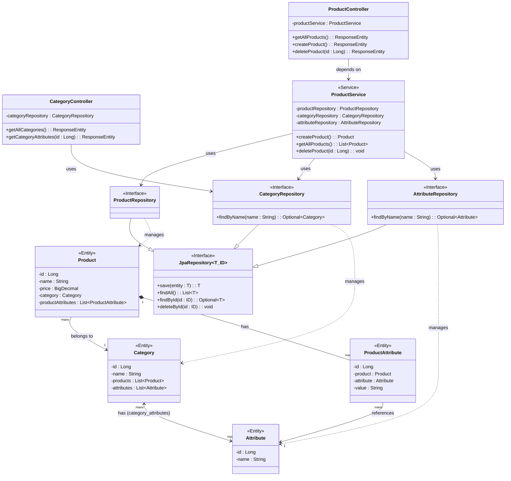
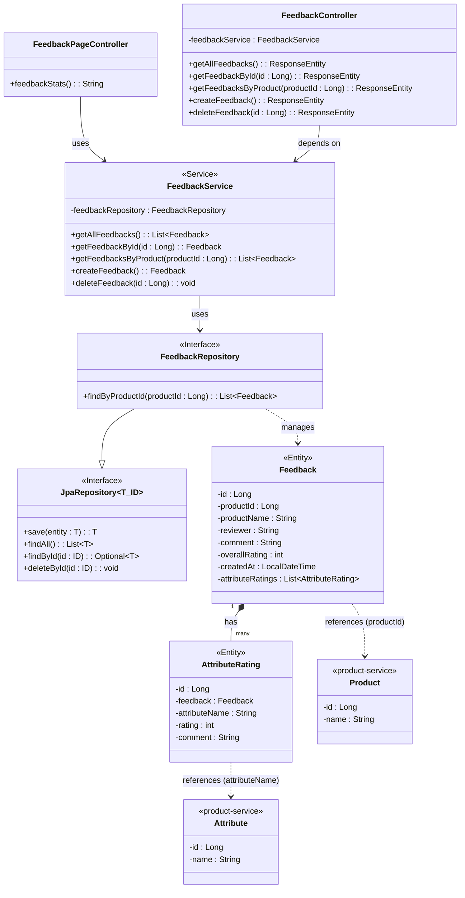
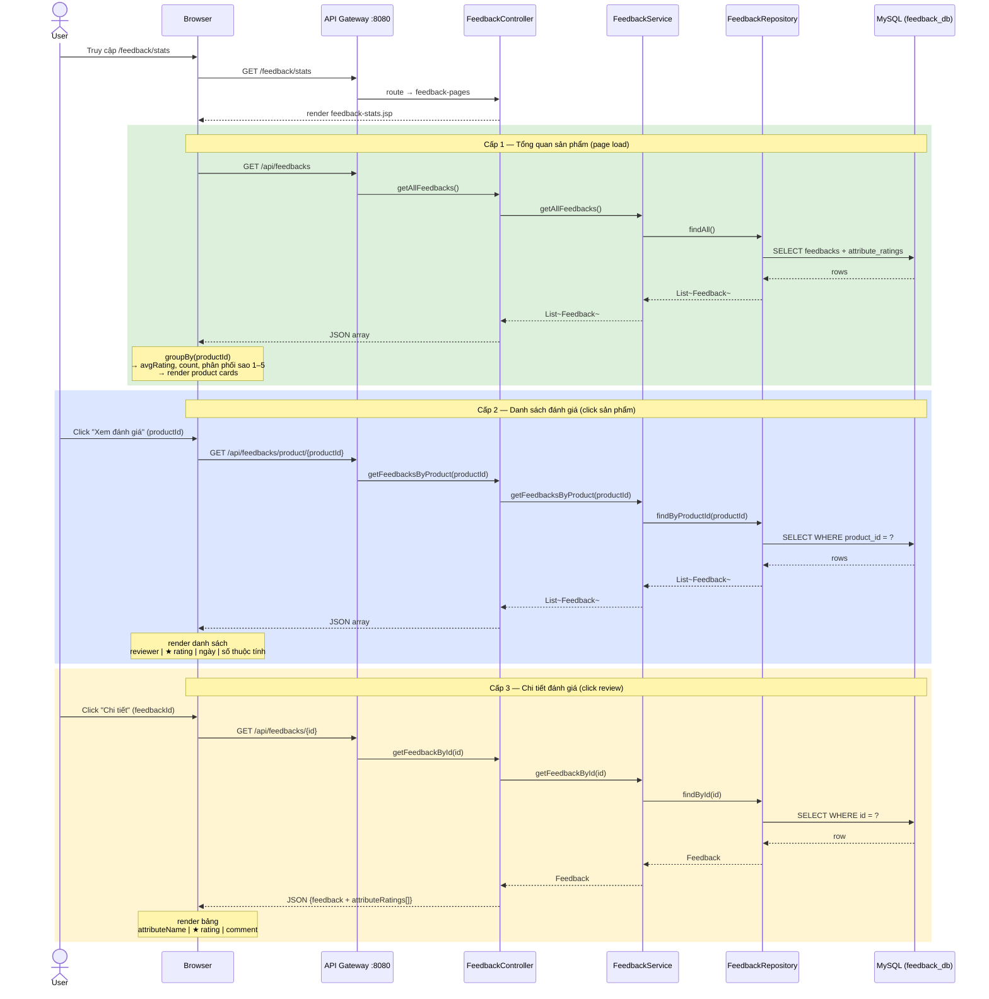

# Kiến Trúc Product Service

Áp dụng mô hình `item_service` (từ sơ đồ UML) vào hệ thống quản lý sản phẩm hiện tại.

---

## Sơ đồ kiến trúc (Class Diagram)



---

## So sánh với kiến trúc gốc (item_service)

| Thành phần (item_service) | Tương đương (product-service) | Ghi chú khác biệt |
|---|---|---|
| `ItemController` | `ProductController` + `CategoryController` | Tách thành 2 controller |
| `ItemService` _(interface)_ | _(không có interface)_ | `ProductService` là class `@Service` trực tiếp |
| `ItemServiceImpl` | `ProductService` | Gộp interface + impl thành một class |
| `ItemRepository` | `ProductRepository` | Tương tự |
| `ItemRequest` | `ProductCreateRequest` | Tách attributes thành `fixedAttributes` + `extraAttributes` |
| `ItemResponse` | `ProductResponse` | Trả `categoryName` (String) thay vì object `Category` |
| `Item` | `Product` | Không có field `unit`, `stockQuantity`, `description` |
| `Category` | `Category` | Bổ sung quan hệ `@ManyToMany` với `Attribute` |
| `ItemAttribute` | `ProductAttribute` | Thêm field `value` thay cho `description` |
| `Attribute` | `Attribute` | Không có field `description` |

---

## Luồng xử lý: Tạo sản phẩm mới

```
Client
  │ 
  ▼  POST /api/products  {name, price, categoryId, fixedAttributes, extraAttributes}
ProductController.createProduct()
  │
  ▼
ProductService.createProduct()
  ├─► CategoryRepository.findById(categoryId)          → lấy Category
  ├─► AttributeRepository.findByName / findById        → lấy/tạo Attribute
  ├─► new Product(name, price, category)
  ├─► new ProductAttribute(product, attribute, value)  (cho mỗi attribute)
  └─► ProductRepository.save(product)
  │
  ▼
ProductController → ResponseEntity (HTTP 201 Created)
```

---

## Cấu trúc package

```
com.example.product
├── config/
│   ├── CorsConfig.java
│   ├── DataSeeder.java          ← seed dữ liệu mẫu lúc khởi động
│   └── TomcatConfig.java
├── controller/
│   ├── ProductController.java   ← REST API /api/products
│   ├── CategoryController.java  ← REST API /api/categories
│   ├── HomeController.java
│   └── ProductPageServlet.java
├── dto/
│   ├── ProductCreateRequest.java
│   └── ProductResponse.java
├── entity/
│   ├── Product.java
│   ├── Category.java
│   ├── Attribute.java
│   └── ProductAttribute.java
├── repository/
│   ├── ProductRepository.java
│   ├── CategoryRepository.java
│   └── AttributeRepository.java
├── service/
│   └── ProductService.java
└── ProductServiceApplication.java
```

---

## Kiến Trúc Feedback Service

### Sơ đồ kiến trúc (Class Diagram)



---

## Luồng xử lý: Thống kê phản hồi (3 cấp)



### Tổng hợp: Luồng data thống kê

```
GET /api/feedbacks
  └─ feedbacks[]
       │
       ▼ JS (client-side aggregation)
       groupBy(productId) → Map<productId, feedbacks[]>
       │
       ├─ count      = feedbacks.length
       ├─ avgRating  = sum(overallRating) / count
       └─ starDist[1..5] = count per star value
       │
       ▼ render Cấp 1
       [Product Card]  tên SP | ★ avgRating | N đánh giá | thanh phân phối sao


GET /api/feedbacks/product/{productId}
  └─ feedbacks[] (lọc theo sản phẩm)
       │
       ▼ render Cấp 2
       [Review Row]  avatar | reviewer | ★ overallRating | createdAt | N thuộc tính


GET /api/feedbacks/{id}
  └─ feedback { ..., attributeRatings[] }
       │
       ▼ render Cấp 3
       [Detail Table]  attributeName | ★★★★☆ (rating) | comment
```

### Cấu trúc package

```
com.example.feedback
├── config/
│   ├── CorsConfig.java
│   ├── FeedbackDataSeeder.java  ← seed 10 phản hồi mẫu lúc khởi động
│   └── TomcatConfig.java
├── controller/
│   ├── FeedbackPageController.java  ← GET /feedback/stats → JSP
│   └── FeedbackController.java      ← REST API /api/feedbacks
├── entity/
│   ├── Feedback.java
│   └── AttributeRating.java
├── repository/
│   ├── FeedbackRepository.java
│   └── AttributeRatingRepository.java
├── service/
│   └── FeedbackService.java
└── FeedbackServiceApplication.java
```
